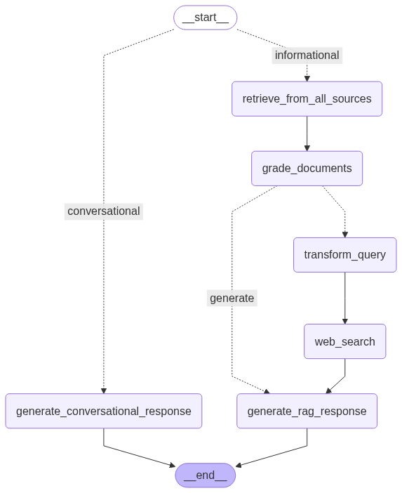

# Agents-langChain-langGraph 🤖

This repository will contain code for building LangChain and LangGraph Generative AI Agents such as 
- Self-Corrective & Agentic RAG Agents with document and internet search capabilties
- SQL Agents for interacting with a relational database
- Multi-Agent collaborators

# Agents

## 1. [Deep Researcher Multi-Agent](./deep_researcher_multi-agent/) -> [demo](./deep_researcher_multi-agent/demo.ipynb)

A moderately complex multi-agent system for automated research and report writing. The system comprises three specialized agents working together to research topics, analyze information, and generate comprehensive reports.

Could be extended to retrieve report source and context from a vector store, knowledge graph, APIs like Cohere, Exa, Arxiv, Pubmed.

## 2. [Self-Corrective Agentic RAG](./self-corrective-agentic-RAG/) -> [demo](./self-corrective-agentic-RAG/static/agentic_rag_demo.gif)

An advanced information retrieval and generation system (RAG) designed to produce more accurate, 
reliable answers by combining semantic information from a vector store, relationships from a knowledge graph and self correcting logic. 

## 3. [SQL Agent](./sql-agent/)

An SQL agent that connects to a relational database and answers questions using data from the SQL database.

