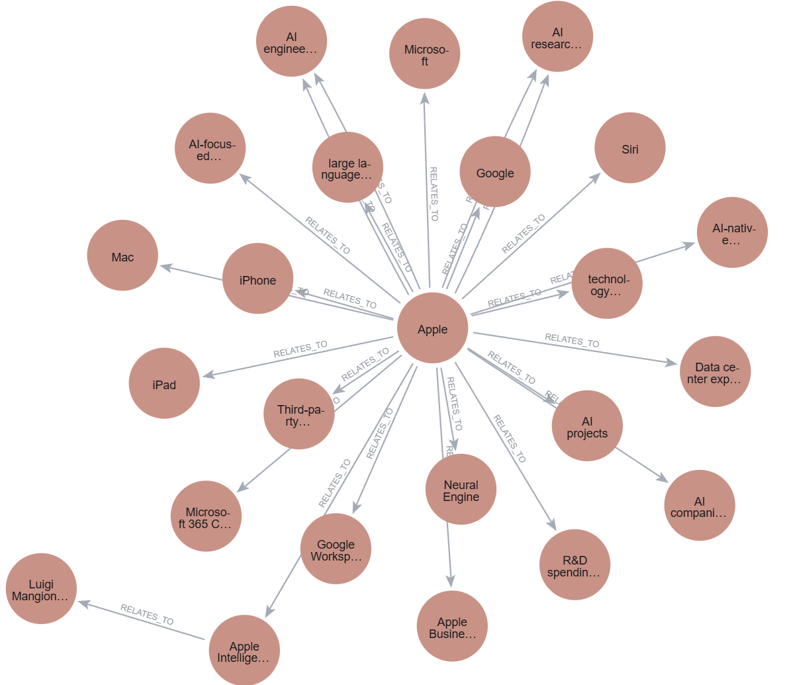
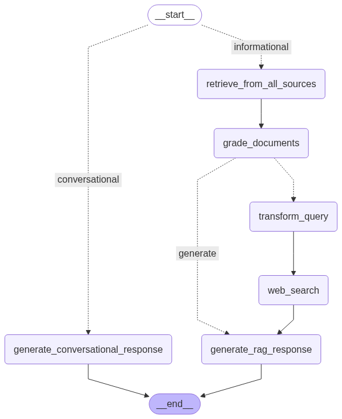
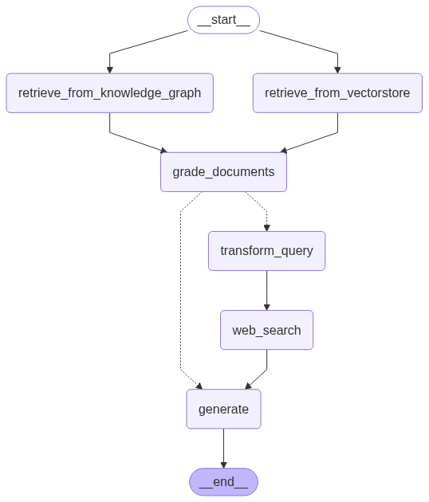

# Corrective x Agentic RAG 🤖

This directory contains code and demo of a self corrective and agentic RAG capable of:
1. Self-reflection
2. Self-grading
3. Reranking
3. Self-control (decides whether to use retriever tool or search the web for more information)

## TODO:
- [ ] Add query classifier
- [x] Build a Knowledge Graph

### Knowledge Graph 🎯

  

### Graph Flow
**Current Version**

**Previous Version**

